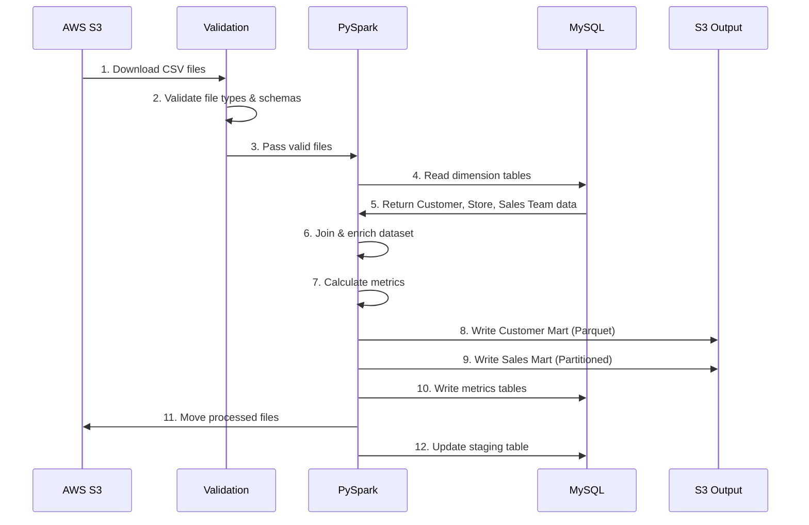

```mermaid
sequenceDiagram
    participant S3 as AWS S3
    participant V as Validation
    participant P as PySpark
    participant DB as MySQL
    participant O as S3 Output
    
    S3->>V: 1. Download CSV files
    V->>V: 2. Validate file types & schemas
    V->>P: 3. Pass valid files
    
    P->>DB: 4. Read dimension tables
    DB->>P: 5. Return Customer, Store, Sales Team data
    
    P->>P: 6. Join & enrich dataset
    P->>P: 7. Calculate metrics
    
    P->>O: 8. Write Customer Mart (Parquet)
    P->>O: 9. Write Sales Mart (Partitioned)
    P->>DB: 10. Write metrics tables
    
    P->>S3: 11. Move processed files
    P->>DB: 12. Update staging table
```
